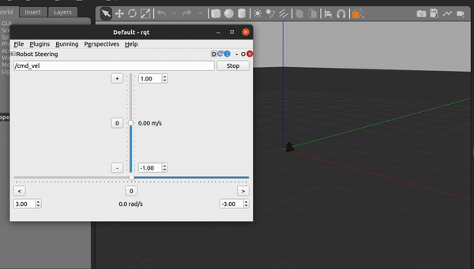

# TurtleBot3 Simulation Setup

# Installation

---

- Check your ROS Installation
    - Use `roscore` to verify ROS installation
    
    
    
    Expected output of `roscore`
    
    - If `roscore` doesn’t start a ROS master try `source /opt/ros/noetic/setup.bash`
- Check Gazebo Installation
    - Use `roslaunch gazebo_ros empty_world.launch` to check Gazebo installation
    
    
    
    Expected output (Gazebo should open)
    
    - If you don’t see this check your environment installation or download a new VM
- Install TurtleBot3 Simulator
    - In a new terminal run `sudo apt install ros-noetic-turtlebot3-*`
    - Enter your VM password and press `y` to allow installation
- Export model type
    - In the terminal you want to run the simulator, use `export TURTLEBOT3_MODEL=burger`
    - This will set the model type to *burger*
- Run TurtleBot3 Simulator
    - Run the simulator with `roslaunch turtlebot3_gazebo turtlebot3_empty_world.launch`
    
    
    
    Expected output (TurtleBot in Gazebo)
    

# Control your Robot

---

Now that your simulator is setup and you can see your robot in Gazebo, its time to control it!

- In a new terminal use `rqt` to open a new window
- From Plugins → Robot Tools open Robot Steering

Expected output - Robot Steering in rqt

- Set the topic to `/cmd_vel`
- You can now use the sliders to set forward and angular velocity and control your robot
- Check Gazebo to see if your robot responds to your commands

Expected output - Robot control using Robot Steering